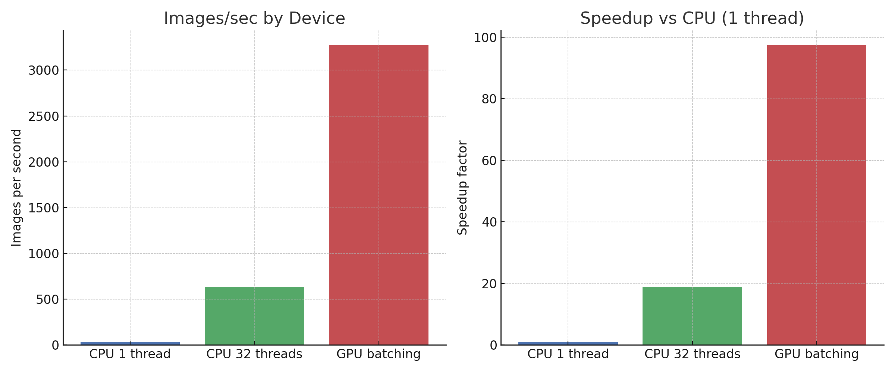

# AMD HIP image filters

Fast GPU-accelerated image filters (HIP) with a CPU fallback path for portability.

## Prerequisites
- AMD ROCm
- OpenMP
- Meson build system


### Tested on:

hipcc --version\
HIP version: 6.4.43484-123eb5128\
AMD clang version 19.0.0git (/srcdest/rocm-llvm d366fa84f3fdcbd4b10847ebd5db572ae12a34fb)


## Compilation
```bash
meson setup build --native-file native/hip.ini --reconfigure
ninja -C build
```

## Usage

### Help
```bash
./build/src/app/hip-img-fx --help
Running HIP image fx...

Usage: hip-img-fx [options]
Options:
  --input <input_file|input_dir>     Specifies the input file or directory path.
  --output <output_file|output_dir>  Specifies the output file or directory path.
  --filter <filter_type>             Specifies the type of filter to apply (e.g., "grayscale", "negative", "gaussian-blur").
  --use-cpu                          Use CPU for processing instead of GPU.
  --help                             Displays this help information.

Notes:
  - For batch processing, specify both --input and --output as directories.
  - For single image processing, specify both as files.
  - Supported filters: grayscale, negative, gaussian-blur
```

### Examples
```bash
# Launch (single image)
./build/hip-img-fx \
    --input examples/example_01.jpg \
    --filter grayscale \
    --output examples/example_01_output_grayscale.jpg

# Launch batch
./build/hip-img-fx \
    --input examples \
    --filter grayscale \
    --output examples/output
```

### Supported image filters
- Grayscale
- Gaussian Blur
- Negative


### Output example
```bash
~ ./build/hip-img-fx \
    --input examples \
    --filter grayscale \
    --output examples/output

Running HIP image fx...
Input: examples
Output: examples/output
Filter Type: GRAYSCALE
Using GPU for processing.
    HIP Device Count: 1
    Device 0: AMD Radeon RX 6900 XT
        Compute Capability: ------------ = 10.3
        Total Global Memory: ----------- = 17163091968
        Shared Memory per Block: ------- = 65536
        Registers per Block: ----------- = 65536
        Warp Size: --------------------- = 32
        Max Threads per Block: --------- = 1024
        Max Threads Dimension: --------- = (1024, 1024, 1024)
        Max Grid Size: ----------------- = (2147483647, 65536, 65536)
        Clock Rate: -------------------- = 2660000
        Total Constant Memory: --------- = 2147483647
        Multiprocessor Count: ---------- = 40
        L2 Cache Size: ----------------- = 4194304
        Max Threads per Multiprocessor:  = 2048
        Unified Addressing: ------------ = 0
        Memory Clock Rate: ------------- = 1000000
        Memory Bus Width: -------------- = 256
        Peak Memory Bandwidth: --------- = 64.000000

num threads: 32
Loaded 5 images for batch processing.
Launching GPU filter kernel: GRAYSCALE (images 0 to 4)
Batch processing complete: 5 images processed.
Total processing time: 00m 00s 657ms
```

## Benchmark
Tested on a batch of 6499 butterfly images from [Kaggle](https://www.kaggle.com/datasets/phucthaiv02/butterfly-image-classification):

|                      Device |               Total Time |       Images / sec | Speedup vs CPU (single-thread) |
| --------------------------: | -----------------------: | -----------------: | -----------------------------: |
|          **CPU (1 thread)** | 3 m 13.394 s (193.394 s) |   **33.60** imgs/s |                      **1.00×** |
| **CPU (OpenMP 32 threads)** |            00 m 10.210 s |  **636.53** imgs/s |                     **18.94×** |
|          **GPU (batching)** |            00 m 01.985 s | **3274.06** imgs/s |                     **97.43×** |


- **GPU vs CPU (32-thread OpenMP): 5.14×** faster (GPU is ≈ **414.36%** faster than 32-thread CPU).
- **CPU OpenMP (32) vs CPU (1): 18.94×** faster (≈ **1794.16%** faster).
- **GPU vs CPU (1): 97.43×** faster (≈ **9642.77%** faster).

### Notes:
- Both CPU and GPU processed all 6499 images successfully (0 failed).  
- Gaussian blur filter was applied with `blurAmount = 11`.



> Hardware:
>  - AMD Radeon RX 6900 XT
>  - AMD Ryzen 3950X (32 threads OpenMP)
>  - HIP build (-march=native --offload-arch=gfx1030)


## Credits

Images (unsplash.com):
- [example_01](https://unsplash.com/photos/pagoda-surrounded-by-trees-E_eWwM29wfU)
- [example_02](https://unsplash.com/photos/blue-and-brown-bird-on-brown-tree-trunk-DPXytK8Z59Y)
- [example_03](https://unsplash.com/photos/selective-focus-photo-of-giraffe-D6TqIa-tWRY)
- [example_04](https://unsplash.com/photos/black-white-and-yellow-bird-on-brown-tree-branch-during-daytime-vjFC9OjrOtA)
- [example_05](https://unsplash.com/photos/two-white-ferrets-zQTw2g6JY6U)


## License
MIT License. See [LICENSE](LICENSE) for details.

