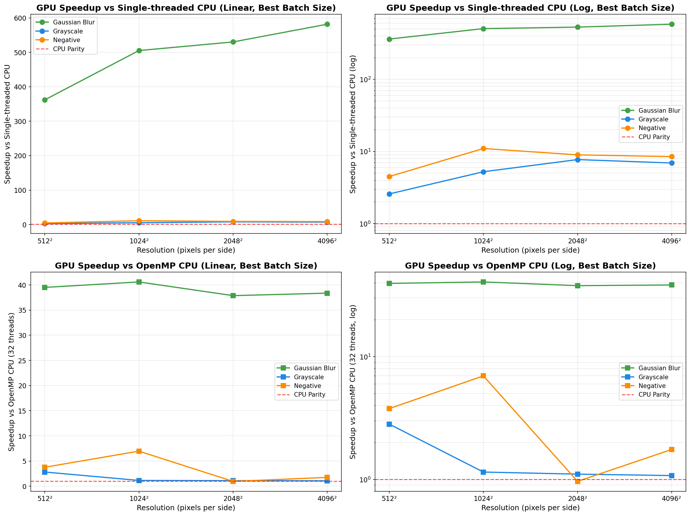
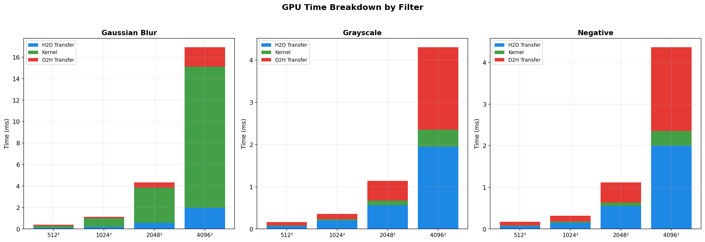
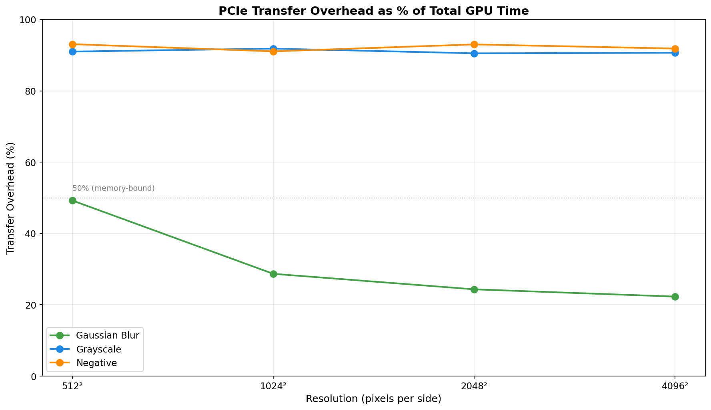
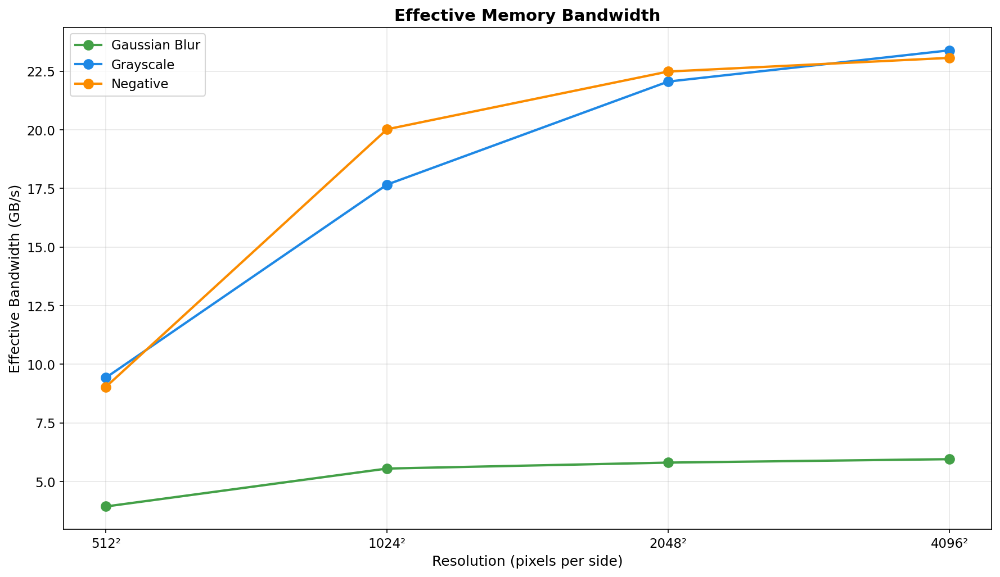
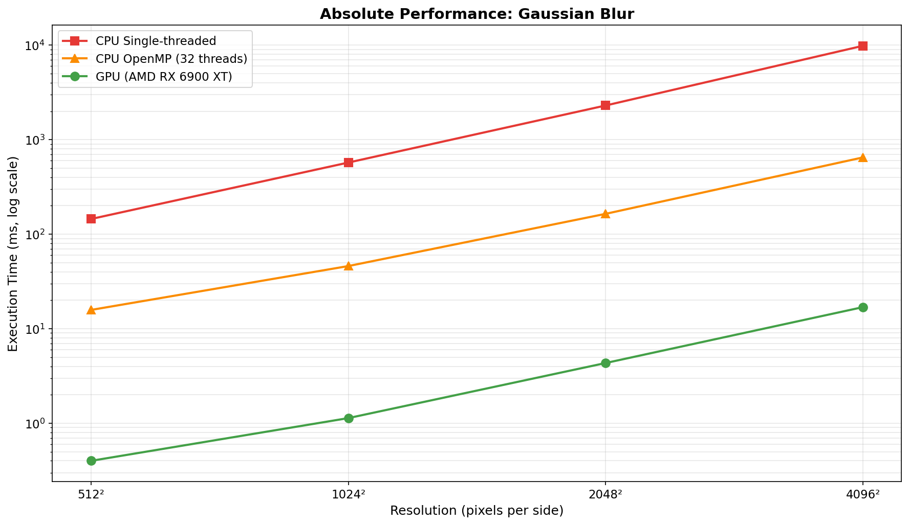
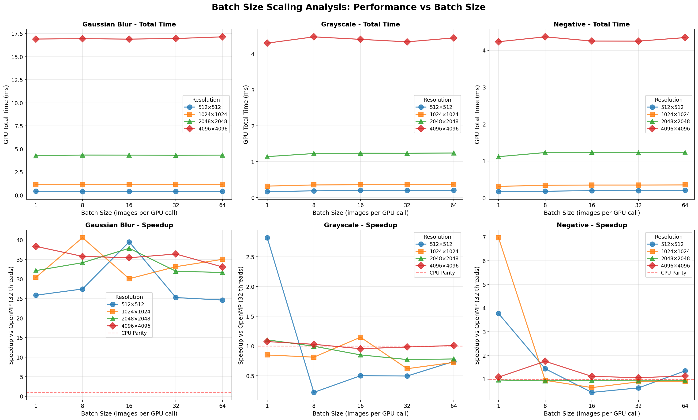

# HIP Image FX – Benchmark Report

**GPU-Accelerated Image Processing Performance Analysis**

*Generated: January 11, 2026*

---

## Executive Summary

| Metric | Value | Details |
|--------|-------|---------|
| **Peak Speedup (vs Single-CPU)** | **582×** | Gaussian Blur @ 4096² |
| **Peak Speedup (vs OpenMP)** | **41×** | Gaussian Blur @ 1024² |
| **Avg Transfer Overhead** | **72%** | of total GPU time |
| **Test Configurations** | **60** | 3 filters × 4 resolutions |

---

## Performance Analysis

### GPU Speedup vs CPU

**GPU Speedup vs CPU (Both Single-threaded and OpenMP)** – Shows performance relative to single-threaded CPU (top row, up to 582×) and OpenMP CPU with 32 threads (bottom row, up to 41×). Gaussian blur achieves massive speedups due to compute-intensive nature, while simple filters are memory-bound.

---

### GPU Time Breakdown

**GPU Time Breakdown** – Shows proportion of time spent in H2D transfer (blue), kernel execution (green), and D2H transfer (red). Note how transfer overhead dominates for simple filters but drops substantially for gaussian blur.

---

### PCIe Transfer Overhead

**PCIe Transfer Overhead** – Percentage of total GPU time spent on memory transfers. Simple filters are 89-97% transfer-dominated, while gaussian blur drops to ~22% at large resolutions.

---

### Effective Memory Bandwidth

**Effective Memory Bandwidth** – Achieved bandwidth increases with image size as transfer overhead amortizes. Peak bandwidth reaches ~23.8 GB/s for large images.

---

### Absolute Performance Comparison

**Absolute Performance Comparison** – Log-scale plot comparing single-threaded CPU, OpenMP CPU (32 threads), and GPU execution times for Gaussian blur. GPU maintains consistent ~16.9ms performance even for 4096² images (best batch for that resolution).

---

### Batch Size Scaling

**Batch Size Scaling** – How per-image GPU time and OpenMP speedup vary with batch size.

---

## Detailed Results

### Best and Worst Case Performance

| Case | Filter | Resolution | GPU Time | Speedup vs Single | Speedup vs OpenMP | Transfer Overhead |
|------|--------|------------|----------|-------------------|-------------------|-------------------|
| **Best (vs Single)** | Gaussian Blur | 4096² | 16.91 ms | 581.6× | 38.4× | 22.3% |
| **Best (vs OpenMP)** | Gaussian Blur | 1024² | 1.13 ms | 505.1× | 40.6× | 28.7% |
| **Worst** | Grayscale | 512² | 0.19 ms | 4.1× | 0.2× | 95.7% |

---

### Complete Results Table

| Filter | Resolution | Batch Size | GPU Total (ms) | Kernel (ms) | Speedup vs Single | Speedup vs OpenMP | Bandwidth (GB/s) |
|--------|------------|------------|----------------|-------------|-------------------|-------------------|------------------|
| Gaussian Blur | 512² | 1 | 0.426 | 0.217 | 358.29× | 25.85× | 3.69 |
| Gaussian Blur | 512² | 8 | 0.381 | 0.204 | 385.88× | 27.45× | 4.13 |
| Gaussian Blur | 512² | 16 | 0.400 | 0.202 | 361.94× | 39.50× | 3.93 |
| Gaussian Blur | 512² | 32 | 0.396 | 0.202 | 352.83× | 25.26× | 3.98 |
| Gaussian Blur | 512² | 64 | 0.403 | 0.204 | 363.66× | 24.62× | 3.91 |
| Gaussian Blur | 1024² | 1 | 1.129 | 0.824 | 501.63× | 30.42× | 5.57 |
| Gaussian Blur | 1024² | 8 | 1.133 | 0.808 | 505.09× | 40.59× | 5.55 |
| Gaussian Blur | 1024² | 16 | 1.149 | 0.821 | 495.33× | 30.08× | 5.47 |
| Gaussian Blur | 1024² | 32 | 1.154 | 0.820 | 494.37× | 33.16× | 5.45 |
| Gaussian Blur | 1024² | 64 | 1.156 | 0.823 | 498.23× | 35.04× | 5.44 |
| Gaussian Blur | 2048² | 1 | 4.269 | 3.217 | 529.63× | 32.15× | 5.89 |
| Gaussian Blur | 2048² | 8 | 4.340 | 3.295 | 531.13× | 34.18× | 5.80 |
| Gaussian Blur | 2048² | 16 | 4.335 | 3.279 | 530.14× | 37.87× | 5.81 |
| Gaussian Blur | 2048² | 32 | 4.315 | 3.285 | 520.04× | 32.01× | 5.83 |
| Gaussian Blur | 2048² | 64 | 4.335 | 3.301 | 529.82× | 31.66× | 5.81 |
| Gaussian Blur | 4096² | 1 | 16.910 | 13.139 | 581.63× | 38.36× | 5.95 |
| Gaussian Blur | 4096² | 8 | 16.947 | 13.133 | 579.58× | 35.79× | 5.94 |
| Gaussian Blur | 4096² | 16 | 16.902 | 13.145 | 576.04× | 35.44× | 5.96 |
| Gaussian Blur | 4096² | 32 | 16.967 | 13.212 | 575.91× | 36.40× | 5.93 |
| Gaussian Blur | 4096² | 64 | 17.149 | 13.370 | 572.22× | 33.09× | 5.87 |
| Grayscale | 512² | 1 | 0.167 | 0.014 | 2.58× | 2.82× | 9.43 |
| Grayscale | 512² | 8 | 0.187 | 0.008 | 4.06× | 0.22× | 8.41 |
| Grayscale | 512² | 16 | 0.204 | 0.007 | 2.76× | 0.50× | 7.70 |
| Grayscale | 512² | 32 | 0.196 | 0.006 | 2.34× | 0.50× | 8.02 |
| Grayscale | 512² | 64 | 0.204 | 0.007 | 2.09× | 0.74× | 7.70 |
| Grayscale | 1024² | 1 | 0.319 | 0.036 | 10.36× | 0.85× | 19.73 |
| Grayscale | 1024² | 8 | 0.352 | 0.025 | 5.42× | 0.81× | 17.89 |
| Grayscale | 1024² | 16 | 0.356 | 0.029 | 5.24× | 1.15× | 17.67 |
| Grayscale | 1024² | 32 | 0.360 | 0.031 | 5.30× | 0.62× | 17.45 |
| Grayscale | 1024² | 64 | 0.363 | 0.031 | 4.90× | 0.72× | 17.35 |
| Grayscale | 2048² | 1 | 1.141 | 0.108 | 7.73× | 1.10× | 22.06 |
| Grayscale | 2048² | 8 | 1.227 | 0.123 | 6.15× | 1.00× | 20.50 |
| Grayscale | 2048² | 16 | 1.237 | 0.122 | 5.90× | 0.85× | 20.35 |
| Grayscale | 2048² | 32 | 1.236 | 0.122 | 5.85× | 0.77× | 20.37 |
| Grayscale | 2048² | 64 | 1.241 | 0.123 | 6.13× | 0.78× | 20.28 |
| Grayscale | 4096² | 1 | 4.303 | 0.401 | 6.93× | 1.07× | 23.39 |
| Grayscale | 4096² | 8 | 4.479 | 0.487 | 6.60× | 1.03× | 22.47 |
| Grayscale | 4096² | 16 | 4.409 | 0.484 | 6.56× | 0.95× | 22.83 |
| Grayscale | 4096² | 32 | 4.340 | 0.483 | 6.63× | 0.98× | 23.20 |
| Grayscale | 4096² | 64 | 4.450 | 0.491 | 6.62× | 1.01× | 22.62 |
| Negative | 512² | 1 | 0.174 | 0.013 | 4.50× | 3.77× | 9.04 |
| Negative | 512² | 8 | 0.183 | 0.006 | 4.31× | 1.44× | 8.61 |
| Negative | 512² | 16 | 0.199 | 0.005 | 3.99× | 0.44× | 7.92 |
| Negative | 512² | 32 | 0.196 | 0.005 | 2.83× | 0.63× | 8.03 |
| Negative | 512² | 64 | 0.211 | 0.005 | 2.75× | 1.35× | 7.46 |
| Negative | 1024² | 1 | 0.314 | 0.029 | 10.99× | 6.97× | 20.03 |
| Negative | 1024² | 8 | 0.345 | 0.018 | 7.29× | 0.95× | 18.26 |
| Negative | 1024² | 16 | 0.351 | 0.021 | 6.58× | 0.64× | 17.91 |
| Negative | 1024² | 32 | 0.351 | 0.021 | 6.44× | 0.89× | 17.93 |
| Negative | 1024² | 64 | 0.354 | 0.021 | 6.34× | 0.90× | 17.76 |
| Negative | 2048² | 1 | 1.119 | 0.078 | 8.97× | 0.96× | 22.49 |
| Negative | 2048² | 8 | 1.230 | 0.087 | 7.52× | 0.93× | 20.47 |
| Negative | 2048² | 16 | 1.236 | 0.090 | 7.41× | 0.95× | 20.36 |
| Negative | 2048² | 32 | 1.228 | 0.090 | 7.21× | 0.93× | 20.50 |
| Negative | 2048² | 64 | 1.229 | 0.091 | 7.38× | 0.94× | 20.48 |
| Negative | 4096² | 1 | 4.231 | 0.297 | 8.55× | 1.08× | 23.79 |
| Negative | 4096² | 8 | 4.363 | 0.355 | 8.50× | 1.75× | 23.07 |
| Negative | 4096² | 16 | 4.249 | 0.356 | 8.30× | 1.12× | 23.69 |
| Negative | 4096² | 32 | 4.247 | 0.357 | 8.35× | 1.06× | 23.70 |
| Negative | 4096² | 64 | 4.343 | 0.363 | 8.19× | 1.13× | 23.18 |

---

## Key Insights

### Compute-Bound vs Memory-Bound

**Gaussian blur** is compute-intensive (O(n² × kernel_size²)) and shows excellent GPU scaling, achieving 353-582× speedup vs single-threaded CPU. **Grayscale and negative** are memory-bound (simple per-pixel operations) and range from 0.22-6.97× vs OpenMP, limited by PCIe transfer overhead.

### Batch Processing Architecture

The system uses configurable batch processing:

- **Batch sizes tested:** 1, 8, 16, 32, 64 images per GPU call
- **Memory allocation:** Single large contiguous buffer for entire batch
- **Kernel launch:** One kernel processes all images in batch simultaneously
- **Performance impact:** Batch size can shift results for memory-bound filters because transfers dominate
- **Optimal batch size:** Varies by filter and resolution

### Resolution Scaling

As image resolution increases, kernel execution time grows quadratically while transfer overhead (as a percentage) decreases. This makes GPU acceleration more effective for larger images, especially for compute-bound operations like gaussian blur.

---

## Technical Details

| Parameter | Value |
|-----------|-------|
| **GPU** | AMD Radeon RX 6900 XT |
| **Framework** | HIP/ROCm |
| **Architecture** | Batch processing with synchronous execution |
| **Batch Sizes Tested** | 1, 8, 16, 32, 64 images |
| **Image Format** | RGB (3 channels), 8-bit per channel |
| **Test Resolutions** | 512², 1024², 2048², 4096² |
| **CPU Baseline (Single)** | Single-threaded |
| **CPU Baseline (OpenMP)** | 32 threads |
| **Filters Tested** | Grayscale, Negative, Gaussian Blur (11×11 kernel) |

---

*Generated by `analyze_results.py`*
